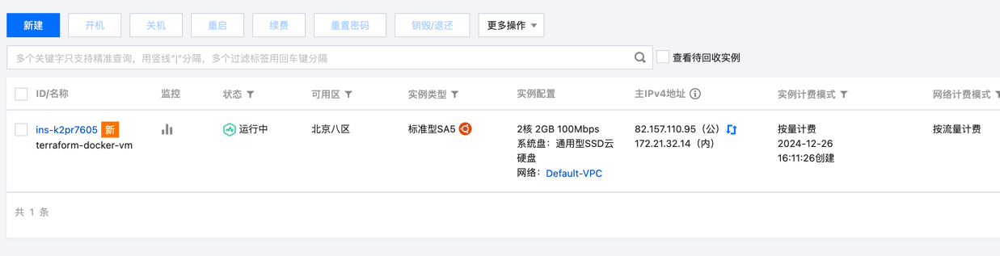

# 实践 Terraform，开通腾讯云虚拟机，并安装 Docker
* 腾讯云 secret id key在 ~/.zshrc 中声明变量
```bash
export TENCENTCLOUD_SECRET_ID="AKIDPfg"
export TENCENTCLOUD_SECRET_KEY="81f5GCT" 
```
* 配置ssh公私钥，免配置密码
```bash
resource "tencentcloud_key_pair" "default" {
  key_name   = "skey_8psgl2e3"
  public_key = file("~/.ssh/id_rsa.pub")
}
```
* 使用*remote-exec*远程安装docker
```bash
  provisioner "remote-exec" {
    connection {
      type        = "ssh"
      host        = self.public_ip
      user        = "ubuntu"
      private_key = file("~/.ssh/id_rsa")
    }

    inline = [
      "sudo apt-get update -y",
      "sudo apt-get install -qqy --no-install-recommends docker.io",
      "sudo systemctl enable docker",
      "sudo systemctl start docker"
    ]
  } 
```
* 执行terraform
  * terraform init
  * terraform plan
  * terraform apply
  ```bash 
    Enter a value: yes
  
  tencentcloud_security_group.docker_sg: Creating...
  tencentcloud_key_pair.default: Creating...
  tencentcloud_security_group.docker_sg: Creation complete after 1s [id=sg-mhu7x8zb]
  tencentcloud_key_pair.default: Creation complete after 1s [id=skey-6uozu1at]
  tencentcloud_security_group_lite_rule.default: Creating...
  tencentcloud_instance.docker_vm: Creating...
  tencentcloud_security_group_lite_rule.default: Creation complete after 1s [id=sg-mhu7x8zb]
  tencentcloud_instance.docker_vm: Still creating... [10s elapsed]
  tencentcloud_instance.docker_vm: Still creating... [20s elapsed]
  tencentcloud_instance.docker_vm: Still creating... [30s elapsed]
  tencentcloud_instance.docker_vm: Provisioning with 'remote-exec'...
  tencentcloud_instance.docker_vm (remote-exec): Connecting to remote host via SSH...
  tencentcloud_instance.docker_vm (remote-exec):   Host: 82.157.110.95
  tencentcloud_instance.docker_vm (remote-exec):   User: ubuntu
  tencentcloud_instance.docker_vm (remote-exec):   Password: false
  tencentcloud_instance.docker_vm (remote-exec):   Private key: true
  tencentcloud_instance.docker_vm (remote-exec):   Certificate: false
  tencentcloud_instance.docker_vm (remote-exec):   SSH Agent: true
  tencentcloud_instance.docker_vm (remote-exec):   Checking Host Key: false
  tencentcloud_instance.docker_vm (remote-exec):   Target Platform: unix
  tencentcloud_instance.docker_vm (remote-exec): Connected!
  tencentcloud_instance.docker_vm (remote-exec): 0% [Working]
  tencentcloud_instance.docker_vm (remote-exec): Hit:1 http://mirrors.tencentyun.com/ubuntu jammy InRelease
  tencentcloud_instance.docker_vm (remote-exec): 0% [Waiting for headers]
  tencentcloud_instance.docker_vm (remote-exec): Get:2 http://mirrors.tencentyun.com/ubuntu jammy-updates InRelease [128 kB]
  tencentcloud_instance.docker_vm (remote-exec): 0% [2 InRelease 12.2 kB/128 kB 10%]
  tencentcloud_instance.docker_vm (remote-exec): 0% [Waiting for headers]
  tencentcloud_instance.docker_vm (remote-exec): Get:3 http://mirrors.tencentyun.com/ubuntu jammy-security InRelease [129 kB]
  tencentcloud_instance.docker_vm (remote-exec): 0% [3 InRelease 13.9 kB/129 kB 11%]
  ...
  ```
* 云主机已创建



* docker已安装
```bash
ssh ubuntu@82.157.110.95 "sudo docker version"
Client:
 Version:           24.0.7
 API version:       1.43
 Go version:        go1.21.1
 Git commit:        24.0.7-0ubuntu2~22.04.1
 Built:             Wed Mar 13 20:23:54 2024
 OS/Arch:           linux/amd64
 Context:           default

Server:
 Engine:
  Version:          24.0.7
  API version:      1.43 (minimum version 1.12)
  Go version:       go1.21.1
  Git commit:       24.0.7-0ubuntu2~22.04.1
  Built:            Wed Mar 13 20:23:54 2024
  OS/Arch:          linux/amd64
  Experimental:     false
 containerd:
  Version:          1.7.12
  GitCommit:
 runc:
  Version:          1.1.12-0ubuntu2~22.04.1
  GitCommit:
 docker-init:
  Version:          0.19.0
  GitCommit:
```
