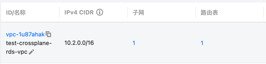
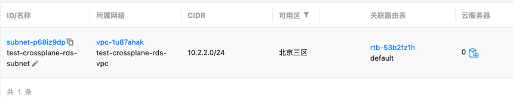
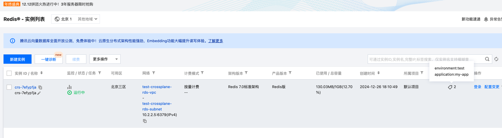
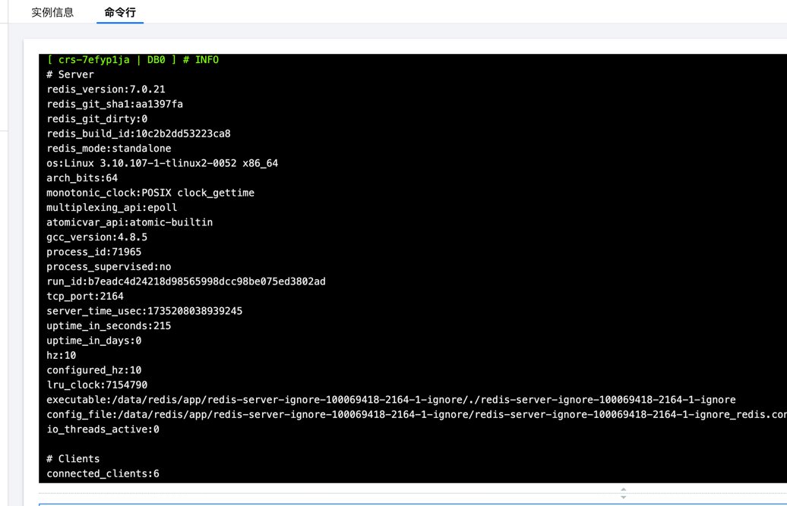
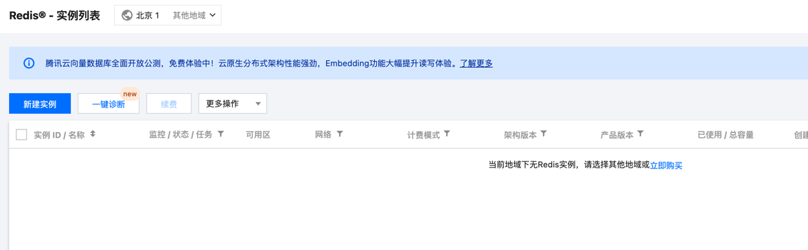

#
## k8s安装配置Crossplane
* helm 安装 Crossplane
```bash
$ helm repo add crossplane-stable https://charts.crossplane.io/stable
"crossplane-stable" has been added to your repositories
$ helm repo update
Hang tight while we grab the latest from your chart repositories...
...Successfully got an update from the "crossplane-stable" chart repository
Update Complete. ⎈Happy Helming!⎈
$ helm install crossplane \
--namespace crossplane-system \
--create-namespace crossplane-stable/crossplane
NAME: crossplane
LAST DEPLOYED: Thu Dec 26 16:32:46 2024
NAMESPACE: crossplane-system
STATUS: deployed
REVISION: 1
TEST SUITE: None
NOTES:
Release: crossplane

Chart Name: crossplane
Chart Description: Crossplane is an open source Kubernetes add-on that enables platform teams to assemble infrastructure from multiple vendors, and expose higher level self-service APIs for application teams to consume.
Chart Version: 1.18.2
Chart Application Version: 1.18.2

Kube Version: v1.24.4
$ kubectl get pods -n crossplane-system
NAME                                       READY   STATUS    RESTARTS   AGE
crossplane-69c79c675f-w5ch8                1/1     Running   0          56s
crossplane-rbac-manager-554687f59c-6nhbh   1/1     Running   0          56s
```
* 安装 Crossplane 的 CLI 插件
```bash
$ curl -sL https://raw.githubusercontent.com/crossplane/crossplane/main/install.sh | sh
```
* 安装 TencentCloud Provider
```bash
$ kubectl apply -f crossplane/provider.yml
provider.pkg.crossplane.io/provider-tencentcloud created
```
* 验证 Provider 安装
```bash
kubectl get providers
NAME                    INSTALLED   HEALTHY   PACKAGE                                                           AGE
provider-tencentcloud   True        True      xpkg.upbound.io/crossplane-contrib/provider-tencentcloud:v0.8.1   2m7s 
```
* 配置 Provider 密钥
```bash
$ kubectl apply -f crossplane/tencentcloud-aksk.yml
secret/tencentcloud-aksk created
```
* 为 Provider 配置密钥
```bash
$ kubectl apply -f crossplane/providerconfig.yml
providerconfig.tencentcloud.crossplane.io/default created 
```
## 使用crossplane 创建Redis数据库
* 创建腾讯云VPC及其子网
```bash
$ kubectl apply -f tencent/vpc.yml
vpc.vpc.tencentcloud.crossplane.io/example-rds-vpc created 
$ kubectl apply -f tencent/subnet.yml
subnet.vpc.tencentcloud.crossplane.io/example-rds-subnet created
$ kubectl get vpc example-rds-vpc
NAME              READY   SYNCED   EXTERNAL-NAME   AGE
example-rds-vpc   True    True     vpc-1u87ahak    27s
```
```bash
$ kubectl get vpc
NAME              READY   SYNCED   EXTERNAL-NAME   AGE         # EXTERNAL-NAME 为腾讯云平台上对应的资源ID
example-rds-vpc   True    True     vpc-1u87ahak    111s
$ kubectl get subnet
NAME                 READY   SYNCED   EXTERNAL-NAME     AGE
example-rds-subnet   True    True     subnet-p68iz9dp   19s
```
控制台查看已创建VPC及其子网





* 创建存储Redis密码的secret
```bash
$ kubectl apply -f tencent/redis-secret.yml
secret/redis-secret created 
```
* `redis-instance.yaml`文件中引用上面的secret
* 创建Redis实例
```bash
$ kubectl apply -f tencent/redis-instance.yml
instance.redis.tencentcloud.crossplane.io/example-redis-instance created
```
* 查看Redis实例
```bash
$ kubectl get instance.redis.tencentcloud.crossplane.io/example-redis-instance
NAME                     READY   SYNCED   EXTERNAL-NAME   AGE
example-redis-instance   True    True     crs-7efyp1ja    60s 
```
* 控制台查看



* 使用密码登录
成功登录



## crossplane删除资源
* 删除Redis实例
```bash
$ kubectl delete instance.redis.tencentcloud.crossplane.io/example-redis-instance
instance.redis.tencentcloud.crossplane.io "example-redis-instance" deleted 
```
实例已删除

