# 基于 ragflow 构建个人运维知识库

## 运行环境

- 硬件配置：4C 16GB ram 100GB disk
- 操作系统：ubuntu22.04
- docker version: 26.1.3
- docker-compose version: v2.31.0

## 源码编译 Docker 镜像（包含 embedding 模型）

```bash
$ git clone https://github.com/infiniflow/ragflow.git
$ cd ragflow/
$ docker build --build-arg NEED_MIRROR=1 -f Dockerfile -t infiniflow/ragflow:nightly .
$ docker images
REPOSITORY           TAG       IMAGE ID       CREATED              SIZE
infiniflow/ragflow   nightly   04a927b3879e   About a minute ago   16.8GB
```

## 修改内核参数

```bash
$ sudo sysctl -p|grep vm.max_map_count
vm.max_map_count = 262144
```

## 启动ragflow

```bash
$ cd ragflow/docker
# 在.env文件中指定镜像
$ grep RAGFLOW_IMAGE .env |grep -v "^#"
RAGFLOW_IMAGE=infiniflow/ragflow:nightly
# 启动容器
$ docker compose -f docker-compose.yml up -d
[+] Running 10/10
 ✔ Network docker_ragflow      Created                                                                0.1s
 ✔ Volume "docker_mysql_data"  Created                                                                0.0s
 ✔ Volume "docker_minio_data"  Created                                                                0.0s
 ✔ Volume "docker_redis_data"  Created                                                                0.0s
 ✔ Volume "docker_esdata01"    Created                                                                0.0s
 ✔ Container ragflow-mysql     Healthy                                                               27.1s
 ✔ Container ragflow-minio     Started                                                                6.7s
 ✔ Container ragflow-redis     Started                                                                6.7s
 ✔ Container ragflow-es-01     Started                                                                6.7s
 ✔ Container ragflow-server    Started                                                               21.4s

$ docker ps
CONTAINER ID   IMAGE                                                  COMMAND                  CREATED         STATUS                   PORTS                                                                                                                 NAMES
1e23108acb60   infiniflow/ragflow:nightly                             "./entrypoint.sh"        2 minutes ago   Up 2 minutes             0.0.0.0:80->80/tcp, :::80->80/tcp, 0.0.0.0:443->443/tcp, :::443->443/tcp, 0.0.0.0:9380->9380/tcp, :::9380->9380/tcp   ragflow-server
40926df37440   docker.elastic.co/elasticsearch/elasticsearch:8.11.3   "/bin/tini -- /usr/l…"   2 minutes ago   Up 2 minutes (healthy)   9300/tcp, 0.0.0.0:1200->9200/tcp, [::]:1200->9200/tcp                                                                 ragflow-es-01
58bf38b93867   mysql:8.0.39                                           "docker-entrypoint.s…"   2 minutes ago   Up 2 minutes (healthy)   33060/tcp, 0.0.0.0:5455->3306/tcp, [::]:5455->3306/tcp                                                                ragflow-mysql
b8bd24cf0a77   quay.io/minio/minio:RELEASE.2023-12-20T01-00-02Z       "/usr/bin/docker-ent…"   2 minutes ago   Up 2 minutes             0.0.0.0:9000-9001->9000-9001/tcp, :::9000-9001->9000-9001/tcp                                                         ragflow-minio
5438ed3344c7   valkey/valkey:8                                        "docker-entrypoint.s…"   2 minutes ago   Up 2 minutes             0.0.0.0:6379->6379/tcp, :::6379->6379/tcp                                                                             ragflow-redis
```

## 通过80端口访问，并配置知识库、进行聊天

- 注册并登录


- 进入User setting -> Modle providers 配置模型，以及相关api参数
  
  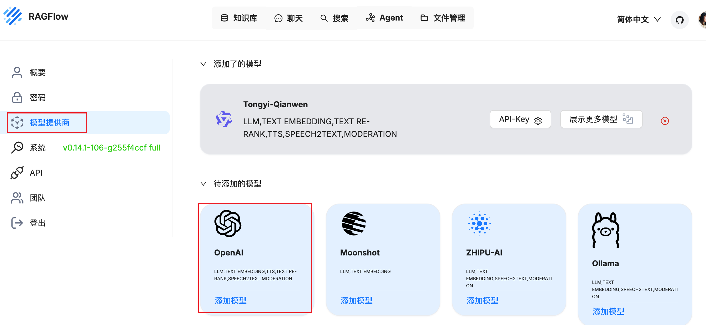
  
  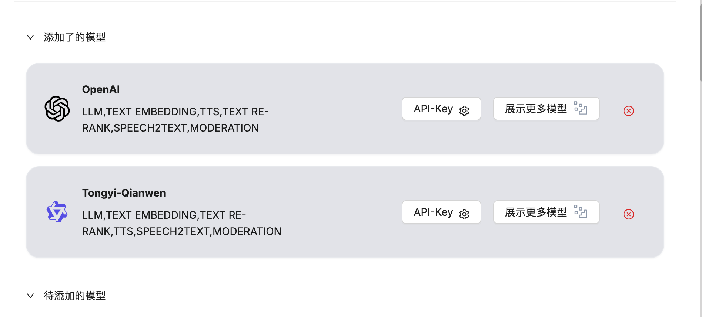
  
  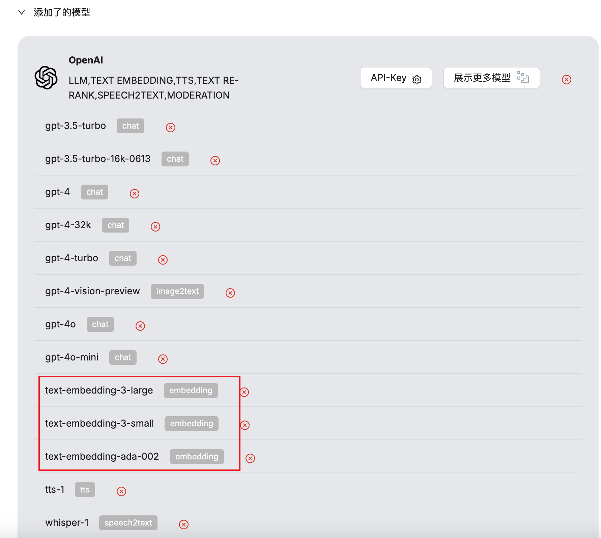

- 创建运维知识库，指定向量化模型，并解析
  
  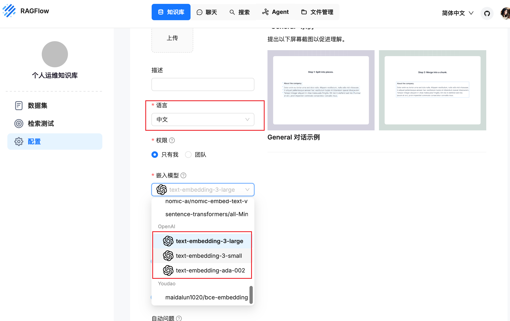
  
  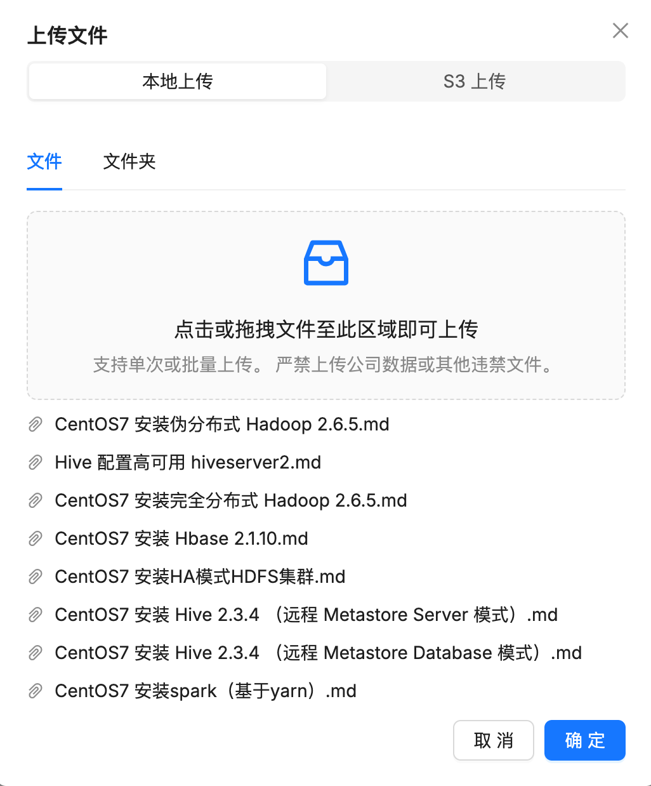
  
  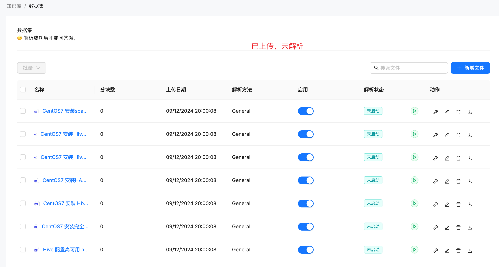
  
  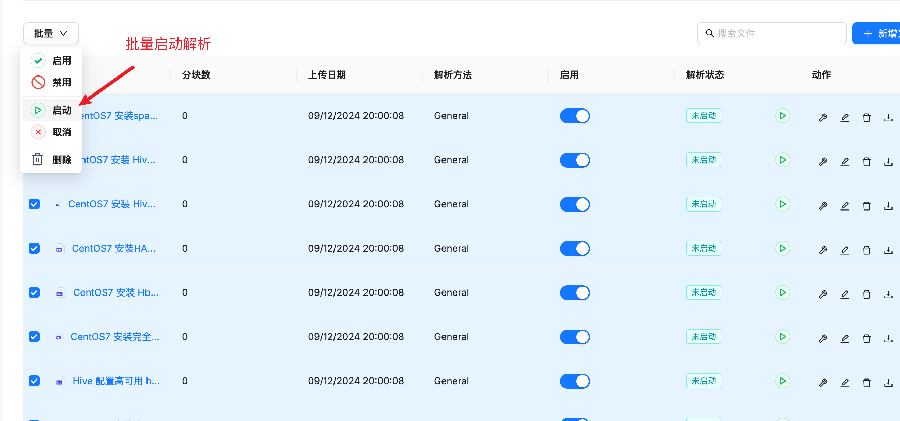
  
  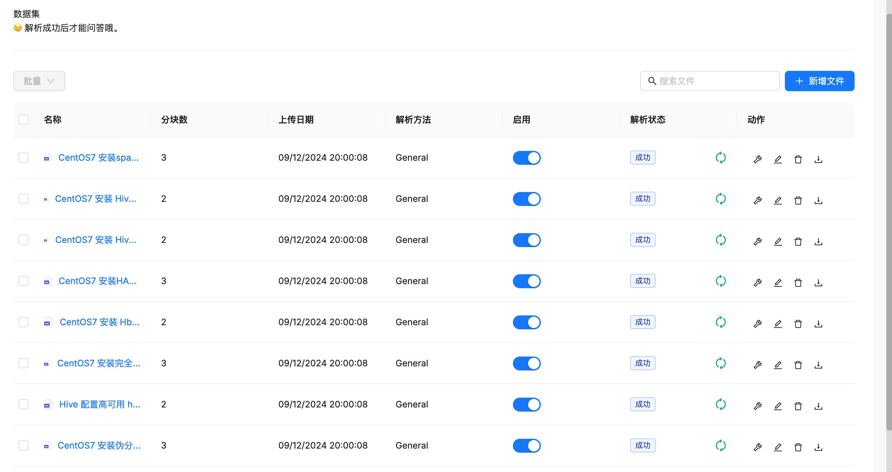

- 创建聊天机器人，并指定刚刚创建的运维知识库
  
  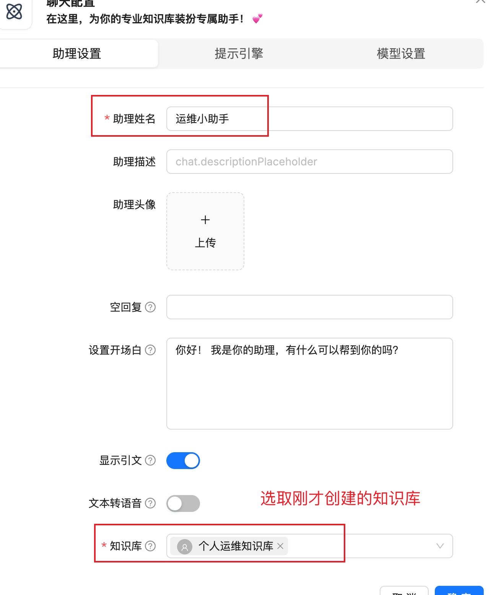
  
  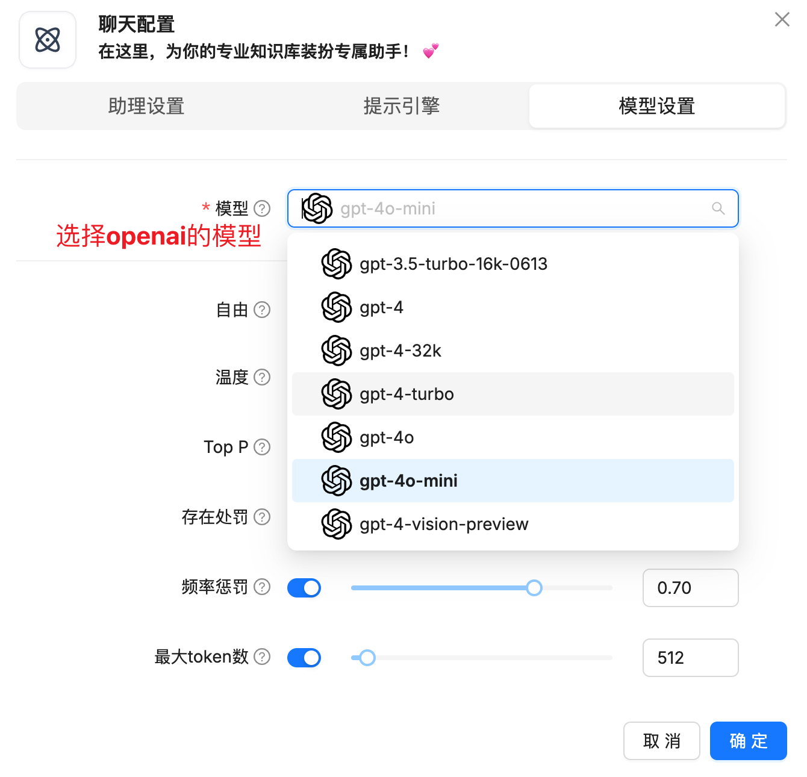

- 进行聊天，机器人会依据知识库给出答案
  
  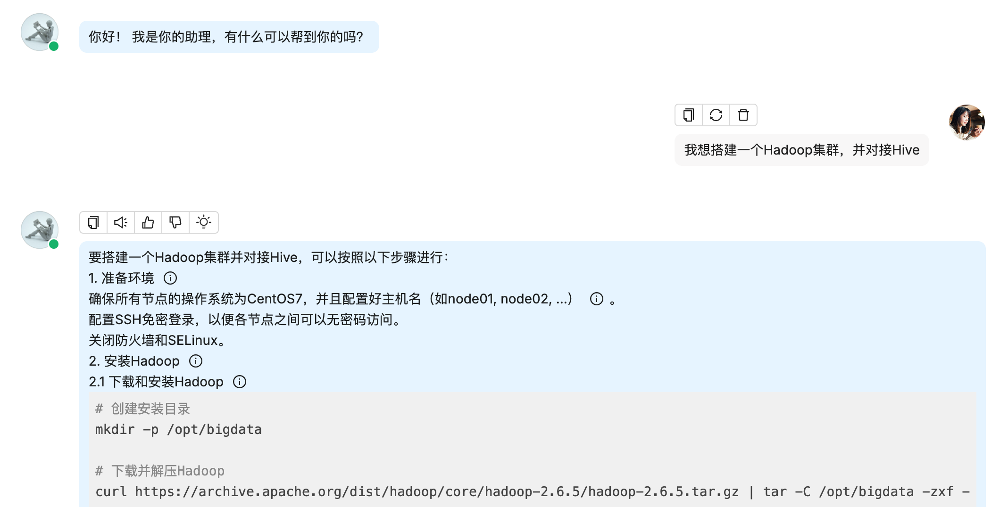
  
  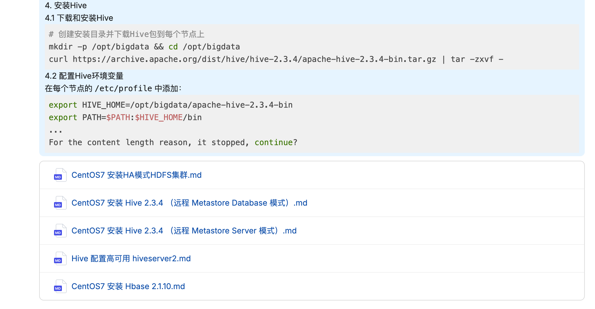
