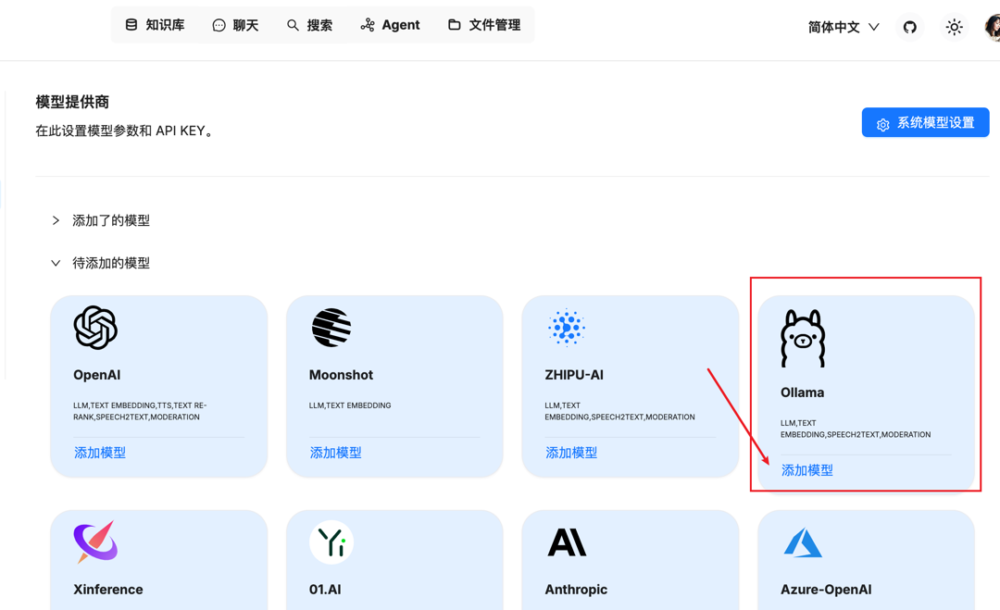
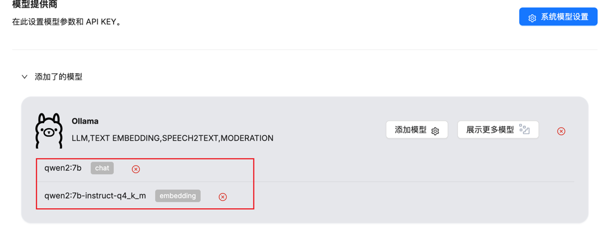
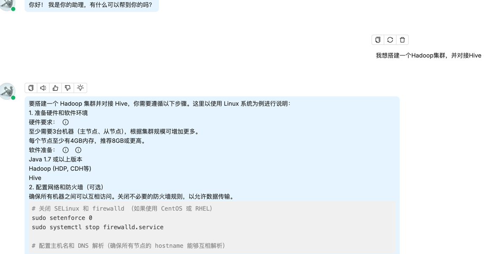
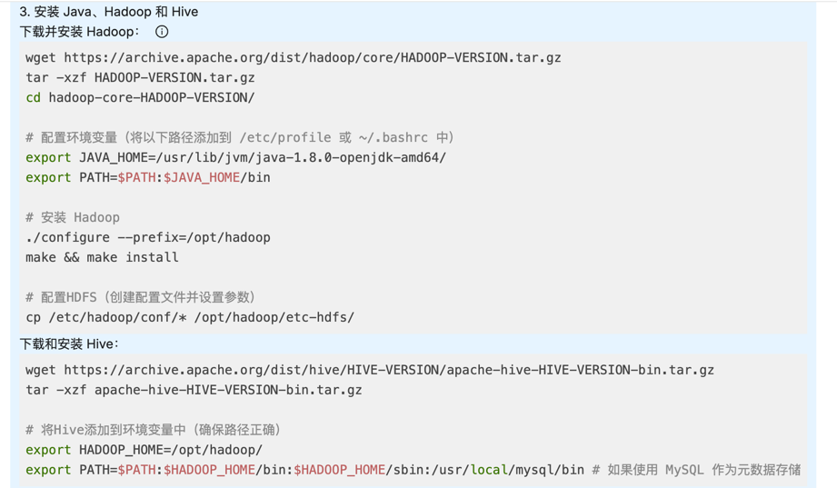
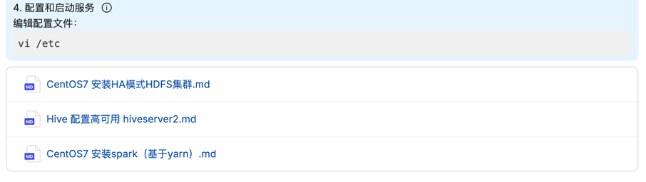

# 自建服务器搭建Ollama，运行Qwen2-7b大模型

> 由于使用课程里terraform脚本去创建Ollama的实验环境太过于开箱即用，掩盖了一些运维感知上的概念
>
> 而恰好手里有个闲置的GTX1070Ti显卡，8G显存，于是有了运行个Qwen2-7b模型的打算，在此记录一下执行步骤
>

## 运行环境
* 硬件配置：4C 64GB RAM 8GB VRAM 100GB disk
* 操作系统：ubuntu22.04

> 参照 [nvidia 文档](https://developer.nvidia.com/cuda-12-4-1-download-archive?target_os=Linux&target_arch=x86_64&Distribution=Ubuntu&target_version=22.04&target_type=deb_network) 安装驱动、cuda工具包
* 软件：
  * Python 3.10.12
  * cuda 12.4
  * nvidia-driver 565.57.01

## 安装Ollama
* 仿照课程里的脚本 `llm.sh` ，进行安装，只是预加载模型部分手动完成
  因为显存只有8G，为了减小显存压力，选取 qwen2-7b-instruct-q4_k_m
* 下载 *qwen2-7b-instruct-q4_k_m.gguf* 文件到本地，同时创建 *Modelfile* 文件
* Ollama 加载模型离线文件
    ```bash
    ubuntu@ubuntu:~$ OLLAMA_HOST=0.0.0.0:8080 ollama create qwen2:7b-instruct-q4_k_m -f Modelfile
    transferring model data 100%
    using existing layer sha256:ed93dfc426f926451fa3ec7f996a787a31cfd97e55d7769568fbffc2d69861c2
    creating new layer sha256:b1f13ec5ebe5fb2281f393c4b12e96f4e26813d68229c51f23bad1f4ef6a04dd
    using existing layer sha256:f02dd72bb2423204352eabc5637b44d79d17f109fdb510a7c51455892aa2d216
    creating new layer sha256:872d994155c02ff21d6f8c40228ab2340db97a2248a5e78441abcde37acaabde
    writing manifest
    success
    ubuntu@ubuntu:~$ OLLAMA_HOST=0.0.0.0:8080 ollama list
    NAME                        ID              SIZE      MODIFIED
    qwen2:7b-instruct-q4_k_m    290b0c92b675    4.7 GB    17 seconds ago
    ```
* 测试模型调用
    ```bash
    ubuntu@ubuntu:~$ curl -X POST http://0.0.0.0:8080/api/chat -H "Content-Type: application/json" \
    -d '{
      "model": "qwen2:7b-instruct-q4_k_m",
      "messages": [{"role": "user", "content": "Hello!"}]
    }'
    
    {"model":"qwen2:7b-instruct-q4_k_m","created_at":"2024-12-25T16:04:14.934585157Z","message":{"role":"assistant","content":"Hello"},"done":false}
    {"model":"qwen2:7b-instruct-q4_k_m","created_at":"2024-12-25T16:04:14.965334428Z","message":{"role":"assistant","content":"!"},"done":false}
    {"model":"qwen2:7b-instruct-q4_k_m","created_at":"2024-12-25T16:04:14.995151423Z","message":{"role":"assistant","content":" How"},"done":false}
    {"model":"qwen2:7b-instruct-q4_k_m","created_at":"2024-12-25T16:04:15.025223633Z","message":{"role":"assistant","content":" can"},"done":false}
    {"model":"qwen2:7b-instruct-q4_k_m","created_at":"2024-12-25T16:04:15.055204432Z","message":{"role":"assistant","content":" I"},"done":false}
    {"model":"qwen2:7b-instruct-q4_k_m","created_at":"2024-12-25T16:04:15.085451492Z","message":{"role":"assistant","content":" assist"},"done":false}
    {"model":"qwen2:7b-instruct-q4_k_m","created_at":"2024-12-25T16:04:15.115663811Z","message":{"role":"assistant","content":" you"},"done":false}
    {"model":"qwen2:7b-instruct-q4_k_m","created_at":"2024-12-25T16:04:15.146174436Z","message":{"role":"assistant","content":" today"},"done":false}
    {"model":"qwen2:7b-instruct-q4_k_m","created_at":"2024-12-25T16:04:15.176645702Z","message":{"role":"assistant","content":"?"},"done":false}
    {"model":"qwen2:7b-instruct-q4_k_m","created_at":"2024-12-25T16:04:15.206419142Z","message":{"role":"assistant","content":""},"done_reason":"stop","done":true,"total_duration":4225490086,"load_duration":3846172871,"prompt_eval_count":11,"prompt_eval_duration":98000000,"eval_count":10,"eval_duration":279000000} 
    ```
  得到反馈，且观察到显存占用升高和对应的运行进程
  ```bash
  ubuntu@ubuntu:~$ nvidia-smi
  Wed Dec 25 16:04:24 2024
  +-----------------------------------------------------------------------------------------+
  | NVIDIA-SMI 565.57.01              Driver Version: 565.57.01      CUDA Version: 12.7     |
  |-----------------------------------------+------------------------+----------------------+
  | GPU  Name                 Persistence-M | Bus-Id          Disp.A | Volatile Uncorr. ECC |
  | Fan  Temp   Perf          Pwr:Usage/Cap |           Memory-Usage | GPU-Util  Compute M. |
  |                                         |                        |               MIG M. |
  |=========================================+========================+======================|
  |   0  NVIDIA GeForce GTX 1070 Ti     On  |   00000000:0B:00.0 Off |                  N/A |
  |  0%   39C    P2             41W /  180W |    5247MiB /   8192MiB |      0%      Default |
  |                                         |                        |                  N/A |
  +-----------------------------------------+------------------------+----------------------+
  
  +-----------------------------------------------------------------------------------------+
  | Processes:                                                                              |
  |  GPU   GI   CI        PID   Type   Process name                              GPU Memory |
  |        ID   ID                                                               Usage      |
  |=========================================================================================|
  |    0   N/A  N/A      1693      C   ...rs/cuda_v12_avx/ollama_llama_server       5242MiB |
  +-----------------------------------------------------------------------------------------+
  ```
-------
# 对接RAGFlow
> 复用第四周的[ragflow环境](../../week04/RAGFlow/README.md)，对接自建ollama
* 添加模型提供商，再通过gguf文件创建一个 *qwen2:7b* 模型，在ragflow中添加模型时分别指定 chat 和 embedding 类型
  
  
* 创建知识库时指定 embedding 类型的模型，创建聊天室指定 chat 类型的模型，最后问相同的问题，对照openai的回复效果 
  
  
  
  
  检索到的文件没有openai多，受制于token长度，输出文本受到了限制
  
