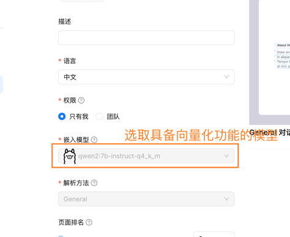
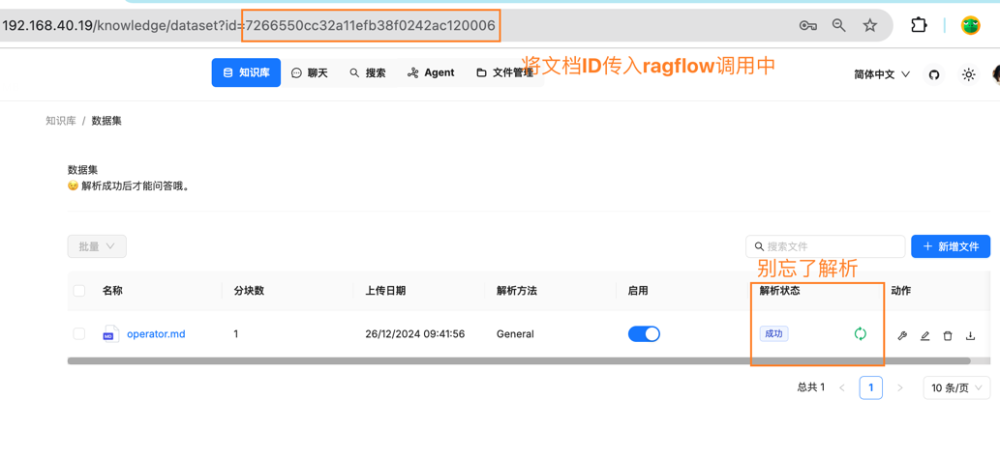
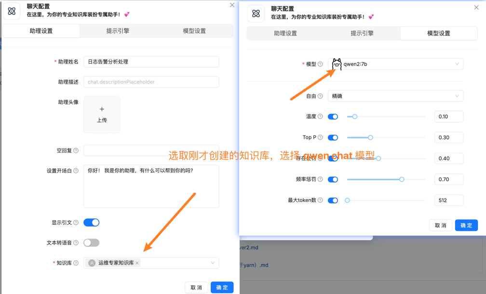
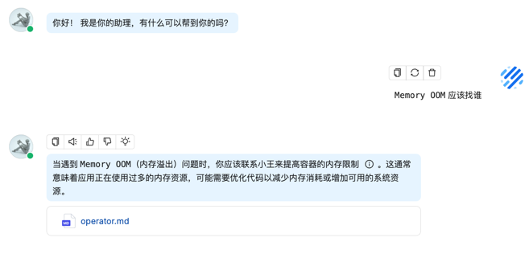
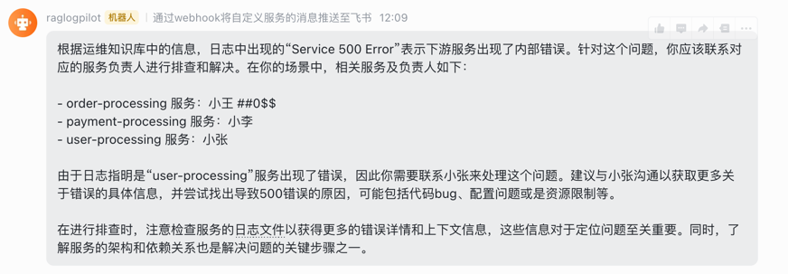

# 配置 RagFlow 接入 Ollama 实现自托管大模型推理
## RagFlow准备工作
* 运维知识库已创建，且已解析
  
  
* 通过chat简单测试一下
  
  
## 修改operator，添加RagFlow调用信息
> 因为ragflow的api接口变了，采用新的规范，先创建chat，再在chat里创建session，使用session对话
* `RagLogPilotSpec` 修改字段，添加对话需要的信息，以及飞书机器人webhook
  ```go
    type RagLogPilotSpec struct {
    
    	WorkloadNameSpace string `json:"workloadNameSpace"`
    	RagFlowEndpoint   string `json:"ragFlowEndpoint"`
    	RagFlowToken      string `json:"ragFlowToken"`
    	FeishuBotWebhook  string `json:"feishuBotWebhook"`
    	DatasetId         string `json:"datasetId"`
    }
  ```
* `RagLogPilotStatus` 添加 chat session id字段 
  ```go
  type RagLogPilotStatus struct {
  	// INSERT ADDITIONAL STATUS FIELD - define observed state of cluster
  	// Important: Run "make" to regenerate code after modifying this file
  	ChatId    string `json:"chatId"`
  	SessionId string `json:"sessionId"`
  }
    ```
* `raglogpilot_controller.go` 修改添加 *createNewChat* 和 *createNewSession* 方法，为与大模型对话创建条件
* `queryRagSystem` 方法中发生对话，创建对话结构体时需要使用新的规范
  ```go
  	payload := map[string]interface{}{
  		"question":   fmt.Sprintf("以下是获取到的日志：%s，请基于运维知识库进行解答，如果你不知道，就说不知道", podLog),
  		"stream":     false,
  		"session_id": ragLogPilot.Status.SessionId,
  	}
  ```
* 生成crd
  ```bash
  $ make manifests
  ~/week08/raglogpilot/bin/controller-gen rbac:roleName=manager-role crd webhook paths="./..." output:crd:artifacts:config=config/crd/bases
  $ make install
  ~/week08/raglogpilot/bin/controller-gen rbac:roleName=manager-role crd webhook paths="./..." output:crd:artifacts:config=config/crd/bases
  Downloading sigs.k8s.io/kustomize/kustomize/v5@v5.5.0
  go: sigs.k8s.io/kustomize/kustomize/v5@v5.5.0 requires go >= 1.22.7; switching to go1.22.10
  ~/week08/raglogpilot/bin/kustomize build config/crd | kubectl apply -f -
  customresourcedefinition.apiextensions.k8s.io/raglogpilots.log.aiops.com created
  $ kubectl api-resources|grep raglog
  raglogpilots                                   log.aiops.com/v1                       true         RagLogPilot
  ```
* 完善 `log_v1_raglogpilot.yaml` 里的信息，并部署
  ```yaml
  spec:
    workloadNameSpace: "default"
    ragFlowEndpoint: "http://192.168.40.19/v1/api"
    ragFlowToken: "ragflow-YzYzc3Y2E4YzMyODExZWZhZjY1MDI0Mm"
    feishuBotWebhook: "https://open.feishu.cn/open-apis/bot/v2/hook/63b50ead-7478-4643-9448-2ba48716727a"
  ```
  ```bash
  $ kubectl apply -f config/samples/log_v1_raglogpilot.yaml
  raglogpilot.log.aiops.com/raglogpilot-sample created
  ```
* 运行operator
  ```bash
  $ make run
  2024-12-26T12:09:13+08:00       INFO    setup   starting manager
  2024-12-26T12:09:13+08:00       INFO    starting server {"name": "health probe", "addr": "[::]:8081"}
  2024-12-26T12:09:13+08:00       INFO    Starting EventSource    {"controller": "raglogpilot", "controllerGroup": "log.aiops.com", "controllerKind": "RagLogPilot", "source": "kind source: *v1.RagLogPilot"}
  2024-12-26T12:09:13+08:00       INFO    Starting Controller     {"controller": "raglogpilot", "controllerGroup": "log.aiops.com", "controllerKind": "RagLogPilot"}
  2024-12-26T12:09:13+08:00       INFO    Starting workers        {"controller": "raglogpilot", "controllerGroup": "log.aiops.com", "controllerKind": "RagLogPilot", "worker count": 1}
  combinedErrorLog:  [26/Dec/2024:02:32:22] ERROR  "Service 500 Error" user-processing
  200
  2024-12-26T12:09:22+08:00       INFO    RAG system response     {"controller": "raglogpilot", "controllerGroup": "log.aiops.com", "controllerKind": "RagLogPilot", "RagLogPilot": {"name":"raglogpilot-sample","namespace":"default"}, "namespace": "default", "name": "raglogpilot-sample", "reconcileID": "4962aff0-1bd3-4b18-8193-e1ede65c80a9", "answer": "根据运维知识库中的信息，日志中出现的“Service 500 Error”表示下游服务出现了内部错误。针对这个问题，你应该联系r-processing 服务：小王 ##0$$\n- payment-processing 服务：小李\n- user-processing 服务：小张\n\n由于日志指明是“user-processing”服务出现了错误，因此你需要联系小张来处理这个问题。建议与小张沟通以获取更多关于错误的具体信息，并尝试找，注意检查服务的日志文件以获得更多的错误详情和上下文信息，这些信息对于定位问题至关重要。同时，了解服务的架构和依赖关系也是解决问题的关键步骤之一。"}
  
  ```
* 飞书已收到告警

  